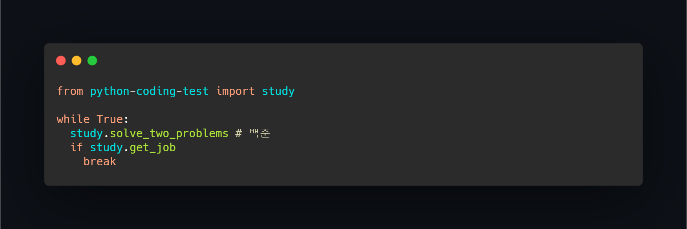

# 💻 파이썬 코딩테스트 스터디 
> 2021.07.12 ~ 

  - [일정안내](#일정안내)
  - [스터디 일지](#스터디-일지)

## 일정안내
- 매주 수요일 저녁 7시 문제풀이 발표 및 공유 
- [📌발표 템플릿](https://github.com/hyunolike/coding-test/wiki/%F0%9F%93%8C%EB%B0%9C%ED%91%9C-%ED%85%9C%ED%94%8C%EB%A6%BF)

|주차|기간|일정|범위|
|--|--|--|--|
|1주차|07.12-07.17|문제풀이|스택|
|2주차|07.19-07.24|문제풀이|큐|
|3주차|07.26-07.31|문제풀이|우선순위 큐(힙)|
|4주차|07.29-08.04|문제풀이|set&map|
|5주차|08.05-08.11|문제풀이|Binary Search|

## 스터디 일지 

<strong>스택(2021.07.12 ~ 2021.07.17)</strong>

 

|문제 번호|문제 이름|
|:------:|:-------:|
|9012|괄호|
|2504|괄호의 값|
|10773|제로|
|1874|스택수열|
|1918|후위 표기식|
|1935|후위 표기식2|
|4949|균형잡힌세상|
|2493|탑|
|3986|좋은 단어|
|2812|크게만들기|

<strong>큐(2021.07.19 ~ 2021.07.24)</strong>

 

|문제 번호|문제 이름|
|:------:|:-------:|
|17225|세훈이의선물가게|
|1966|프린터큐|
|5464|주차장|
|14713|앵무새|
|21775|가희와 자원놀이|
|2164|카드2|
|18258|큐2|
|3078|좋은친구|
|3190|뱀|
|1158|요세푸스|

<strong>우선순위큐,힙(2021.07.26 ~ 2021.07.31)</strong>

 

|문제 번호|문제 이름|
|:------:|:-------:|
|1927|최소 힙|
|11000|강의실배정|
|15903|카드 합체 놀이|
|1715|카드정렬하기|
|14241 |슬라임 합치기|
|12018 |Yonsei TOTO|
|11286 |절대값 힙|
|2075 |N번째 큰 수|
|11279 | 최대 힙|
|1655 |가운데로 말해요|

<strong>set&map(2021.07.29 ~ 2021.08.04)</strong>

 

|문제 번호|문제 이름|
|:------:|:-------:|
|4358|생태학|
|1620|나는야 포켓몬 마스터|
|19583|싸이버개강총회|
|1269|대칭 차집합|
|2002|추월|
|9322|철벽 보안 알고리즘|
|4195|친구 네트워크|
|1302|베스트셀러|
|13414|수강 신청|
|12906|새로운 하노이탑|
|9375|패션왕 신혜빈|
|20166|문자열 지옥에 빠진 호석|

<strong>binary search(2021.08.05~ 2021.08.11)</strong>

 

|문제 번호|문제 이름|
|:------:|:-------:|
|2141|기타레슨|
|2110|공유기 설치|
|1300|K번째 수|
|1072|게임|
|1470|두용액|
|2805|나무 자르기|
|12015|가장 긴 증가하는 부분 수열2|
|17393|다이나믹 롤러|
|1654|랜선 자르기|
|1477|휴게소 세우기|
|8983|사냥꾼|
|11977|Angry cows|

