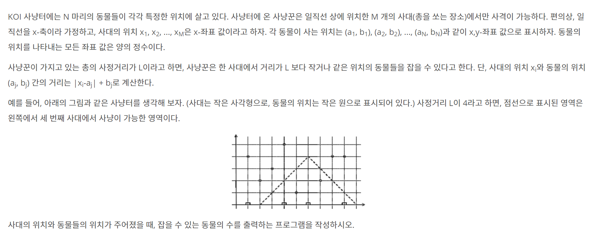

# week5 발표자료

## 1. 8993 사냥꾼


### 1.1 자료구조
1. sand_bags[] : 사격 가능한 사대 위치
2. animals[] : 동물 좌표 위치
3. cal_dist() : 거리 계산 함수
4. binary_search() : 이진 검색 함수
   
### 1.2 풀이과정 
1. 필요한 자료를 입력 받는다.
2. 동물의 수 만큼 반복한다.
   1. 이진검색 함수를 이용해 사냥가능한 동물의 수를 구한다.
3. 출력한다.

### 1.3 소스코드

```python
import sys
input = sys.stdin.readline


def cal_dist(x, a, b):
    return abs(x - a) + b

def binary_search(start, end, i, L):
    global answer
    while start <= end:
        mid = start + (end - start) // 2
        if cal_dist(sand_bags[mid], animals[i][0], animals[i][1]) <= L:
            answer += 1
            break
        else:
            if sand_bags[mid] <= animals[i][0]:
                start = mid + 1
            else:
                end = mid - 1


M, N, L = map(int, input().split())
# 사대 위치
sand_bags = list(map(int, input().split()))
sand_bags.sort()

# 동물 좌표
animals = []

for i in range(N):
    tmp = tuple(map(int, input().split()))
    animals.append(tmp)

animals.sort()

answer = 0

for i in range(N):
    binary_search(0, M - 1, i, L)

print(answer)
```
---

## 2. 1300 k번째 


### 2.1 자료구조
1. temp : 해당 변수가 K랑 일치 여부 확인


### 2.2 풀이과정
1. 입력을 받는다.
2. 이진 탐색 진행
   1. N만큼 반복한다.
      1. temp에 mid 수보다 작은 자연수의 갯수를 더해준다.
   2. temp와 K의 수를 비교


### 2.3 소스코드

```python
N, K = int(input()), int(input())
start, end = 1, K

while start <= end:
    mid = (start + end) // 2

    temp = 0
    for i in range(1, N + 1):
        print(mid, i, mid//i, N)
        print(temp)
        temp += min(mid // i, N)  # mid 이하의 i의 배수 or 최대 N

    if temp >= K:  # 최솟값
        answer = mid
        end = mid - 1
    else: 
        start = mid + 1
print(answer)
```
  