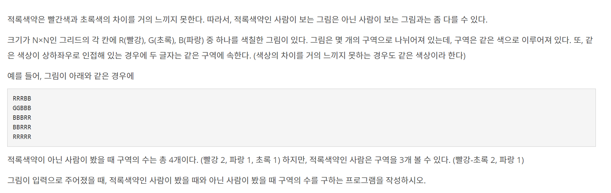

# week5 발표자료

## 1. 10026 적록색약


### 1.1 자료구조
1. visited[] : 방문 확인
2. color[] : 색 배열
3. dfs() : 탐색 함수 
   
### 1.2 풀이과정 
1. 필요한 자료를 입력 받는다.
2. 동물의 수 만큼 반복한다.
   1. 이진검색 함수를 이용해 사냥가능한 동물의 수를 구한다.
3. 출력한다.

### 1.3 소스코드

```python
import sys
sys.setrecursionlimit(10**6)
input = lambda : sys.stdin.readline()

def dfs(x, y):
    visited[x][y] = True
    current_color = color[x][y]

    for i in range(4):
        nx = x + dx[i]
        ny = y + dy[i]

        if nx >= 0 and ny >= 0 and nx < N and ny < N:
            if color[nx][ny] == current_color and not visited[nx][ny]:
                dfs(nx,ny)

N = int(input())
color = [list(input().rstrip()) for _ in range(N)]
visited = [[False]*N for _ in range(N)]
# print(color)

dx = [-1,1,0,0]
dy = [0,0,-1,1]
not_rgb, rgb = 0, 0

for i in range(N):
    for j in range(N):
        if not visited[i][j]:
            dfs(i,j)
            not_rgb += 1

for i in range(N):
    for j in range(N):
        if color[i][j] == 'G':
            color[i][j] = 'R'

visited = [[False]*N for _ in range(N)]

for i in range(N):
    for j in range(N):
        if not visited[i][j]:
            dfs(i,j)
            rgb += 1

print(f'{not_rgb} {rgb}')

```
---
